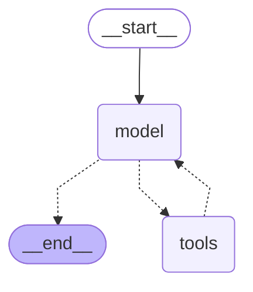

# `langchain` Reference

**Pinned versions: `langchain==1.4.0`** (released 2026-09-03), which resolved
`langchain-core==1.6.2`, `langgraph==1.2.11` and (for the one live example)
`langchain-anthropic==1.7.1`. Everything below was derived by inspecting these exact installed
packages, and every offline example was executed against them on Python 3.13. Each heading links to
<a href="https://reference.langchain.com/python/langchain" target="_blank" rel="noopener">reference.langchain.com</a>,
which is unversioned and always serves the latest 1.x. Links open in a new tab.

Part of a three-file set — see the [README](README.md) for how `langchain-core`,
`langgraph` and `langchain` fit together.

## What `langchain` is in 1.x

- **It is the prebuilt agent layer on top of `langgraph`.** It no longer executes anything itself;
  it assembles a `StateGraph` and hands it to the langgraph runtime.
- **An agent from `create_agent` *is* a compiled langgraph `StateGraph`.** The return annotation is
  literally `CompiledStateGraph[AgentState, ...]`, so `invoke`, `stream`, `get_state`,
  checkpointers and `interrupt` all behave exactly as in the langgraph reference.
- **Its own contribution is the agent loop and middleware.** The model↔tools cycle, structured
  output, and hooks for changing agent behaviour without rewriting the graph.
- **It is small.** The package has seven subpackages: `agents` (whose public API is exactly
  `create_agent` and `AgentState`), `agents.middleware`, `chat_models` (`init_chat_model`),
  `messages`, `tools`, `embeddings`, `rate_limiters` — the last four re-export `langchain-core`
  names — and, new in 1.4.0, `mcp` (`MCPAdapter`, which turns an MCP server's tools into
  `BaseTool`s for `create_agent`; it needs the `langchain[mcp]` extra, i.e. `fastmcp>=4`, and
  raises `ModuleNotFoundError` without it).
- **Layer order:** `langchain` → `langgraph` → `langchain-core`. Import from the lowest layer that
  provides what you need.

> **Old tutorials warning:** `AgentExecutor`, `initialize_agent` and the `Chain` classes
> (`LLMChain`, `ConversationChain`, …) are 0.x patterns now parked in `langchain-classic`
> (currently 1.0.8) — all are absent from `langchain.agents` in 1.4.0, and
> `from langchain.agents import AgentExecutor` raises `ImportError: cannot import name
> 'AgentExecutor'`. If a tutorial uses them, it predates 1.0.

## Index

| Name | What it defines / does | Most-used parameters & methods |
| --- | --- | --- |
| [`create_agent`](#create_agent) | Builds the `model → tools → model …` graph, binds the tools to the model, applies middleware, and returns it compiled | `model`, `tools`, `system_prompt`, `middleware`, `response_format`, `checkpointer` |
| [`AgentState`](#agentstate) | The graph's state `TypedDict`: `messages` (appended via `add_messages`), `jump_to` (middleware redirect, not persisted), `structured_response` (output only) | `messages`, `structured_response`, `jump_to` |
| [`AgentMiddleware`](#agentmiddleware) | Base class with six hook methods (each with an async twin) the loop calls at fixed points, plus `state_schema` and `tools` attributes to extend the agent | `before_model`, `after_model`, `wrap_model_call`, `wrap_tool_call` |
| [`@before_model`](#before_model) | Decorators (`before_agent`, `before_model`, `after_model`, `after_agent`, `wrap_model_call`, `wrap_tool_call`, `dynamic_prompt`) that wrap one function into an `AgentMiddleware` | `before_model`, `after_model`, `wrap_model_call` |
| [`HumanInTheLoopMiddleware`](#humanintheloopmiddleware) | Calls langgraph `interrupt()` before the tools named in `interrupt_on` run; resumes on an `approve`/`edit`/`reject`/`respond` decision per call | `interrupt_on`, `description_prefix` |
| [`ContextEditingMiddleware`](#contexteditingmiddleware) | In `wrap_model_call`, when the token count passes `trigger`, replaces old `ToolMessage` contents with a placeholder in the request only, not in state | `edits`, `token_count_method` |
| [`ToolStrategy`](#toolstrategy) | `response_format=` value: exposes your schema to the model as a tool, parses the resulting call into `state["structured_response"]` | `schema`, `handle_errors` |
| [`init_chat_model`](#init_chat_model) | Splits `"provider:model"`, imports `langchain-<provider>` at call time, and returns that package's chat class | `model`, `model_provider`, `configurable_fields` |

---

### <a href="https://reference.langchain.com/python/langchain/agents/factory/create_agent" target="_blank" rel="noopener"><code>create_agent</code></a>

The one function most 1.x apps start from. What it does with its arguments:

- `model` — a `BaseChatModel`, or a `"provider:model"` string handed to
  [`init_chat_model`](#init_chat_model). It calls `model.bind_tools(tools)` so the model can emit
  `tool_calls`.
- `tools` — `BaseTool`s, plain functions (wrapped with `@tool` for you), or provider tool dicts.
  They become a `ToolNode` that runs each call in the last `AIMessage` and appends one
  `ToolMessage` per call.
- `system_prompt` — a `str` or `SystemMessage` prepended to every model request (not stored in
  state).
- `middleware` — a sequence of [`AgentMiddleware`](#agentmiddleware); their hooks are spliced into
  the graph in order.
- `response_format` — a schema or [`ToolStrategy`](#toolstrategy)/`ProviderStrategy`; the final
  answer is parsed into `state["structured_response"]`.
- `state_schema` / `context_schema` — extend `AgentState` with your own keys; type the read-only
  `runtime.context`.
- `checkpointer`, `store`, `interrupt_before`, `interrupt_after`, `name`, `cache`, `debug` — passed
  straight through to `StateGraph.compile()`.

It returns a `CompiledStateGraph` implementing the loop: call the model; if the reply has
`tool_calls`, run them and go back to the model; otherwise end. Input and output are
`{"messages": [...]}` dicts.

```python
from langchain_core.language_models.fake_chat_models import GenericFakeChatModel
from langchain_core.messages import AIMessage
from langchain_core.tools import tool
from langchain.agents import create_agent


class FakeToolModel(GenericFakeChatModel):
    """GenericFakeChatModel plus the bind_tools() the agent loop requires."""

    def bind_tools(self, tools, **kwargs):
        return self


@tool
def add(a: int, b: int) -> int:
    """Add two integers."""
    return a + b


# Scripted replies stand in for a real model: first a tool call, then the answer.
model = FakeToolModel(messages=iter([
    AIMessage(content="", tool_calls=[{"name": "add", "args": {"a": 2, "b": 3}, "id": "c1"}]),
    AIMessage(content="The answer is 5."),
]))

agent = create_agent(model=model, tools=[add], system_prompt="You are a careful calculator.")
result = agent.invoke({"messages": [{"role": "user", "content": "what is 2+3?"}]})

for m in result["messages"]:
    print(type(m).__name__, "|", repr(m.content))
# HumanMessage | 'what is 2+3?'
# AIMessage | ''            <- the tool call
# ToolMessage | '5'
# AIMessage | 'The answer is 5.'

print(type(agent).__name__)   # CompiledStateGraph
print(agent.get_graph().draw_mermaid())
```

**The reveal** — `create_agent` returns a `CompiledStateGraph`, so you can print the graph it built
for you:



`model -.-> tools` and `tools -.-> model` are the agent loop; `model -.-> __end__` is the exit taken
when the model replies without tool calls. (`draw_mermaid()` wraps the start/end labels in `<p>`
tags, which GitHub shows as literal text — the block above is the same output with those tags
stripped.)

#### The one live example

Everything else in this file runs offline. This is the single variant that talks to a real
provider; it skips itself when `ANTHROPIC_API_KEY` is absent, and it was **not** executed while
preparing this document (no key in the environment).

```python
import os

from langchain_core.tools import tool
from langchain.agents import create_agent
from langchain_anthropic import ChatAnthropic


@tool
def add(a: int, b: int) -> int:
    """Add two integers."""
    return a + b


if os.environ.get("ANTHROPIC_API_KEY"):
    agent = create_agent(model=ChatAnthropic(model="claude-sonnet-5"), tools=[add])
    result = agent.invoke({"messages": [{"role": "user", "content": "what is 2+3?"}]})
    print(result["messages"][-1].text)
else:
    print("ANTHROPIC_API_KEY not set — skipping live example.")
```

[↩ back to index](#index)

---

### <a href="https://reference.langchain.com/python/langchain/agents/middleware/types/AgentState" target="_blank" rel="noopener"><code>AgentState</code></a>

The `TypedDict` the agent graph runs on — a langgraph state with exactly three keys:

- `messages: Required[Annotated[list[AnyMessage], add_messages]]` — the conversation; nodes
  return new messages and the reducer appends them (or replaces by `id`).
- `jump_to: NotRequired[JumpTo | None]` — set by middleware to redirect control flow
  (`"model"`, `"tools"` or `"end"`). Annotated `EphemeralValue` and `PrivateStateAttr`: it is
  cleared after each step and never appears in the output.
- `structured_response: NotRequired[ResponseT]` — filled only when `response_format` is set;
  annotated `OmitFromInput`, so callers cannot pass it in.

Subclass it to carry extra keys (`class MyState(AgentState): user_id: str`) and pass the subclass
as `state_schema=`; middleware can also declare a `state_schema` and the union of all of them is
the graph's real state.

```python
from langchain_core.language_models.fake_chat_models import GenericFakeChatModel
from langchain_core.messages import AIMessage
from langchain.agents import AgentState, create_agent

print(list(AgentState.__annotations__))
# ['messages', 'jump_to', 'structured_response']

agent = create_agent(model=GenericFakeChatModel(messages=iter([AIMessage("hi back")])), tools=[])
result = agent.invoke({"messages": [{"role": "user", "content": "hi"}]})
print(list(result))                       # ['messages']   <- jump_to is private, structured_response unset
print(result["messages"][-1].content)     # hi back
```

[↩ back to index](#index)

---

### <a href="https://reference.langchain.com/python/langchain/agents/middleware/types/AgentMiddleware" target="_blank" rel="noopener"><code>AgentMiddleware</code></a>

The extension point. Rather than rebuilding the graph, you attach objects that the loop calls at
fixed points. The class defines six hooks, each a no-op until overridden and each with an
`a`-prefixed async twin:

| Hook | Called | Receives → returns |
| --- | --- | --- |
| `before_agent(state, runtime)` | once, before the first model call | state update dict or `None` |
| `before_model(state, runtime)` | before every model call | state update dict, or `{"jump_to": "end"}` to skip the model |
| `wrap_model_call(request, handler)` | around every model call | `handler(request)` runs the model; you may edit `request.messages`, `request.tools`, `request.system_message`, `request.model` first, or return your own `ModelResponse` |
| `after_model(state, runtime)` | after every model call, before tools run | state update dict or `None` |
| `wrap_tool_call(request, handler)` | around every tool call | edit `request.tool_call`, call `handler`, or return a `ToolMessage` yourself |
| `after_agent(state, runtime)` | once, after the final reply | state update dict or `None` |

Two class attributes extend the agent itself: `state_schema` (a `TypedDict` whose keys are merged
into `AgentState`) and `tools` (extra `BaseTool`s the middleware brings along).

Middleware that ships in 1.4.0, all built from these hooks: `SummarizationMiddleware` (compress
old turns), `ContextEditingMiddleware`, `HumanInTheLoopMiddleware`, `ModelCallLimitMiddleware` and
`ToolCallLimitMiddleware` (stop runaway loops), `ModelFallbackMiddleware`, `ModelRetryMiddleware`,
`ToolRetryMiddleware`, `ToolErrorMiddleware`, `PIIMiddleware` (redact patterns), `TodoListMiddleware`,
`LLMToolSelectorMiddleware` and `ProviderToolSearchMiddleware` (narrow a large tool set),
`ShellToolMiddleware` and `FilesystemFileSearchMiddleware` (add tools), `LLMToolEmulator` (fake
tools for tests).

```python
from langchain_core.language_models.fake_chat_models import GenericFakeChatModel
from langchain_core.messages import AIMessage
from langchain.agents import create_agent
from langchain.agents.middleware import AgentMiddleware


class CountingMiddleware(AgentMiddleware):
    def __init__(self):
        super().__init__()
        self.calls = 0

    def before_model(self, state, runtime):
        self.calls += 1
        return None


counter = CountingMiddleware()
agent = create_agent(
    model=GenericFakeChatModel(messages=iter([AIMessage("ok")])),
    tools=[],
    middleware=[counter],
)
agent.invoke({"messages": [{"role": "user", "content": "hi"}]})
print("before_model fired:", counter.calls)   # before_model fired: 1
```

[↩ back to index](#index)

---

### <a href="https://reference.langchain.com/python/langchain/agents/middleware/types/before_model" target="_blank" rel="noopener"><code>@before_model</code></a>

For middleware that needs no state of its own, skip the subclass: decorate a single function and
pass it straight to `middleware=`. Each decorator wraps the function into an `AgentMiddleware`
instance that overrides exactly one hook. The family, one per hook plus one convenience:

- `@before_agent`, `@before_model`, `@after_model`, `@after_agent` — `fn(state, runtime)`;
  return `None` to leave the run unchanged, or a state update dict to change it.
- `@wrap_model_call`, `@wrap_tool_call` — `fn(request, handler)`; call `handler(request)` to
  proceed (possibly with an edited request) and return its result or your own.
- `@dynamic_prompt` — `fn(request) -> str`; the string becomes the system prompt for that call,
  recomputed every turn.

```python
from langchain_core.language_models.fake_chat_models import GenericFakeChatModel
from langchain_core.messages import AIMessage
from langchain.agents import create_agent
from langchain.agents.middleware import AgentMiddleware, before_model, dynamic_prompt


@before_model
def log_turn(state, runtime):
    print("[middleware] messages so far:", len(state["messages"]))
    return None


@dynamic_prompt
def prompt_for(request) -> str:
    return f"You are answering turn {len(request.messages)}."


agent = create_agent(
    model=GenericFakeChatModel(messages=iter([AIMessage("hi back")])),
    tools=[],
    middleware=[log_turn, prompt_for],
)
print(type(log_turn).__name__, isinstance(log_turn, AgentMiddleware))
# log_turn True   <- the decorator built an AgentMiddleware subclass named after the function
print(agent.invoke({"messages": [{"role": "user", "content": "hi"}]})["messages"][-1].content)
# [middleware] messages so far: 1
# hi back
```

[↩ back to index](#index)

---

### <a href="https://reference.langchain.com/python/langchain/agents/middleware/human_in_the_loop/HumanInTheLoopMiddleware" target="_blank" rel="noopener"><code>HumanInTheLoopMiddleware</code></a>

Pauses the agent before named tools run and waits for a human decision. What it does:

- `interrupt_on` maps a tool name to `True` (always ask, all decisions allowed) or an
  `InterruptOnConfig` dict: `allowed_decisions` (subset of `approve`, `edit`, `reject`, `respond`),
  `description` (text or a callable building it), `args_schema`, and `when` (a predicate on the
  tool call, so only some calls pause).
- In `after_model`, if the reply contains a call to such a tool, it calls langgraph's `interrupt()`
  with `{"action_requests": [...], "review_configs": [...]}` — one `action_request` per pending
  call, with its `name`, `args` and a `description` built from `description_prefix`.
- It needs a `checkpointer`, because pausing means persisting the run; `invoke` returns an
  `__interrupt__` key and you resume with `Command(resume={"decisions": [...]})`, one decision per
  action request, in order.
- Decisions: `{"type": "approve"}` runs the call as is; `{"type": "edit", "edited_action":
  {"name", "args"}}` runs it with your arguments; `{"type": "reject", "message": "..."}` skips the
  call and feeds the message back to the model as the tool result; `{"type": "respond", ...}`
  answers the model directly without running the tool.

```python
from langchain_core.language_models.fake_chat_models import GenericFakeChatModel
from langchain_core.messages import AIMessage
from langchain_core.tools import tool
from langgraph.checkpoint.memory import InMemorySaver
from langgraph.types import Command
from langchain.agents import create_agent
from langchain.agents.middleware import HumanInTheLoopMiddleware


class FakeToolModel(GenericFakeChatModel):
    def bind_tools(self, tools, **kwargs):
        return self


@tool
def add(a: int, b: int) -> int:
    """Add two integers."""
    return a + b


model = FakeToolModel(messages=iter([
    AIMessage(content="", tool_calls=[{"name": "add", "args": {"a": 2, "b": 3}, "id": "c1"}]),
    AIMessage(content="The answer is 5."),
]))

agent = create_agent(
    model=model,
    tools=[add],
    middleware=[HumanInTheLoopMiddleware(interrupt_on={"add": True})],
    checkpointer=InMemorySaver(),
)

config = {"configurable": {"thread_id": "1"}}
paused = agent.invoke({"messages": [{"role": "user", "content": "what is 2+3?"}]}, config)
print(list(paused))                                       # ['messages', '__interrupt__']
request = paused["__interrupt__"][0].value["action_requests"][0]
print(request["name"], request["args"])                   # add {'a': 2, 'b': 3}

resumed = agent.invoke(Command(resume={"decisions": [{"type": "approve"}]}), config)
print(resumed["messages"][-1].content)                    # The answer is 5.
```

[↩ back to index](#index)

---

### <a href="https://reference.langchain.com/python/langchain/agents/middleware/context_editing/ContextEditingMiddleware" target="_blank" rel="noopener"><code>ContextEditingMiddleware</code></a>

Context management. It implements `wrap_model_call`: before each model request it counts the
tokens in the messages (`token_count_method="approximate"` by default, `"model"` to ask the model,
or your own `token_counter`) and, if a threshold is crossed, rewrites the copy of the messages
**being sent to the model** — the persisted state is untouched, so the full history is still there
for later turns and for you. The rewriting is described by `edits`; the one built-in is
<a href="https://reference.langchain.com/python/langchain/agents/middleware/context_editing/ClearToolUsesEdit" target="_blank" rel="noopener"><code>ClearToolUsesEdit</code></a>:

- `trigger=100000` — token count at which it acts;
- `keep=3` — the most recent tool results to leave alone;
- `clear_at_least=0` — keep clearing until at least this many tokens are freed;
- `clear_tool_inputs=False` — also blank the arguments in the `AIMessage.tool_calls`;
- `exclude_tools=()` — tool names never cleared;
- `placeholder="[cleared]"` — what replaces the content.

Because it acts on the request, not the state, observing it means looking at what the model
received — which is what the recording model below does.

```python
from langchain_core.language_models.fake_chat_models import GenericFakeChatModel
from langchain_core.messages import AIMessage
from langchain_core.tools import tool
from langchain.agents import create_agent
from langchain.agents.middleware import ClearToolUsesEdit, ContextEditingMiddleware

seen: list[list] = []


class RecordingModel(GenericFakeChatModel):
    """Records the messages handed to the model on each call."""

    def bind_tools(self, tools, **kwargs):
        return self

    def _generate(self, messages, stop=None, run_manager=None, **kwargs):
        seen.append(list(messages))
        return super()._generate(messages, stop=stop, run_manager=run_manager, **kwargs)


@tool
def fetch_report(topic: str) -> str:
    """Fetch a long report."""
    return "LONG REPORT " * 50


def second_model_call_sees(middleware):
    seen.clear()
    model = RecordingModel(messages=iter([
        AIMessage(content="", tool_calls=[
            {"name": "fetch_report", "args": {"topic": "sales"}, "id": "c1"}
        ]),
        AIMessage(content="Summarised."),
    ]))
    agent = create_agent(model=model, tools=[fetch_report], middleware=middleware)
    result = agent.invoke({"messages": [{"role": "user", "content": "report?"}]})
    return repr(seen[1][-1].content)[:40], repr(result["messages"][2].content)[:40]


print("without:", second_model_call_sees([]))
# without: ("'LONG REPORT LONG REPORT LONG REPORT LON", "'LONG REPORT LONG REPORT LONG REPORT LON")

print("with:   ", second_model_call_sees(
    [ContextEditingMiddleware(edits=[ClearToolUsesEdit(trigger=1, keep=0)])]
))
# with:    ("'[cleared]'", "'LONG REPORT LONG REPORT LONG REPORT LON")
#           ^ what the model saw            ^ what stayed in state
```

[↩ back to index](#index)

---

### <a href="https://reference.langchain.com/python/langchain/agents/structured_output/ToolStrategy" target="_blank" rel="noopener"><code>ToolStrategy</code></a>

Structured output. Pass `response_format=` to `create_agent` and the final answer is parsed into
your schema and placed in `state["structured_response"]` instead of being left as prose. Two
strategies exist:

- `ToolStrategy(schema, handle_errors=True, tool_message_content=None)` — registers `schema` as
  an extra tool named after it; when the model calls that tool the agent validates the arguments
  against the schema, appends a `ToolMessage` (its content from `tool_message_content`) and ends.
  Validation failures are fed back to the model for another try when `handle_errors` is on. Works
  with any tool-calling model. `schema` may be a Pydantic model, a dataclass, a `TypedDict`, a
  JSON-schema dict, or a `Union` of several.
- `ProviderStrategy(schema, strict=None)` — uses the provider's native JSON-schema response mode
  instead of a tool; only for providers that have one.

Passing a bare schema (`response_format=Answer`) lets `create_agent` pick: `ProviderStrategy` when
the model's profile says it supports native structured output, `ToolStrategy` otherwise.

```python
from langchain_core.language_models.fake_chat_models import GenericFakeChatModel
from langchain_core.messages import AIMessage
from langchain.agents import create_agent
from langchain.agents.structured_output import ToolStrategy
from pydantic import BaseModel


class Answer(BaseModel):
    value: int
    explanation: str


class FakeToolModel(GenericFakeChatModel):
    def bind_tools(self, tools, **kwargs):
        return self


model = FakeToolModel(messages=iter([
    AIMessage(content="", tool_calls=[
        {"name": "Answer", "args": {"value": 5, "explanation": "2+3=5"}, "id": "s1"}
    ]),
]))

agent = create_agent(model=model, tools=[], response_format=ToolStrategy(Answer))
result = agent.invoke({"messages": [{"role": "user", "content": "what is 2+3?"}]})

answer = result["structured_response"]
print(type(answer).__name__, "|", answer.value, "|", answer.explanation)
# Answer | 5 | 2+3=5
print([type(m).__name__ for m in result["messages"]])
# ['HumanMessage', 'AIMessage', 'ToolMessage']   <- the schema "tool" was called and answered
```

[↩ back to index](#index)

---

### <a href="https://reference.langchain.com/python/langchain/chat_models/base/init_chat_model" target="_blank" rel="noopener"><code>init_chat_model</code></a>

Builds a chat model from a `"provider:model"` string, so the provider becomes configuration rather
than a hard-coded import. What it does: splits the string on `:` (or takes `model_provider=`, or
infers the provider from well-known model-name prefixes such as `claude-`/`gpt-`), maps the provider
to a package (`anthropic` → `langchain_anthropic.ChatAnthropic`, `openai` → `langchain_openai.ChatOpenAI`,
`ollama`, `google_genai`, `bedrock`, …), imports that package **at call time**, and instantiates the
class with the remaining kwargs (`temperature=`, `max_tokens=`, …). With `configurable_fields=`,
it instead returns a wrapper whose model can be chosen per call through `config`.

**It does not remove your dependency on the provider package.** The package must already be
installed — if it isn't, you get an `ImportError` telling you what to `pip install`. The dependency
moves from import-time to call-time; it does not disappear. `create_agent(model="anthropic:...")`
calls this function for you.

```python
from langchain.chat_models import init_chat_model

# langchain-anthropic IS installed here, so this constructs fine (no API key needed to build it).
model = init_chat_model("anthropic:claude-sonnet-5")
print(type(model).__name__)   # ChatAnthropic

# langchain-openai is NOT installed here — the dynamic import fails at call time.
try:
    init_chat_model("openai:gpt-4o-mini")
except ImportError as e:
    print("ImportError:", e)
# ImportError: Initializing ChatOpenAI requires the langchain-openai package.
# Please install it with `pip install langchain-openai`
```

[↩ back to index](#index)
