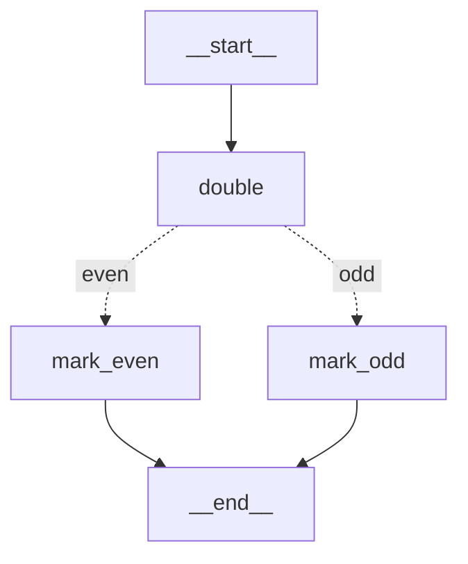
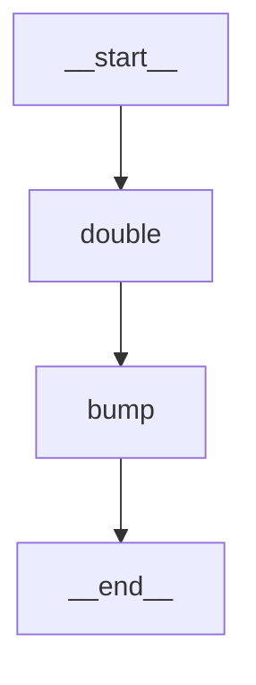
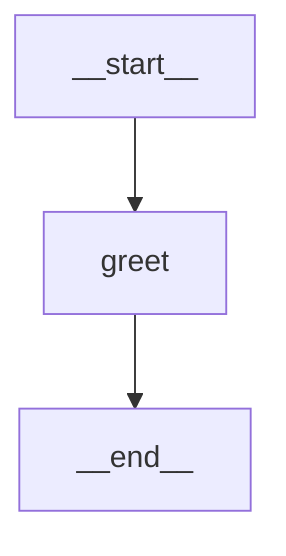
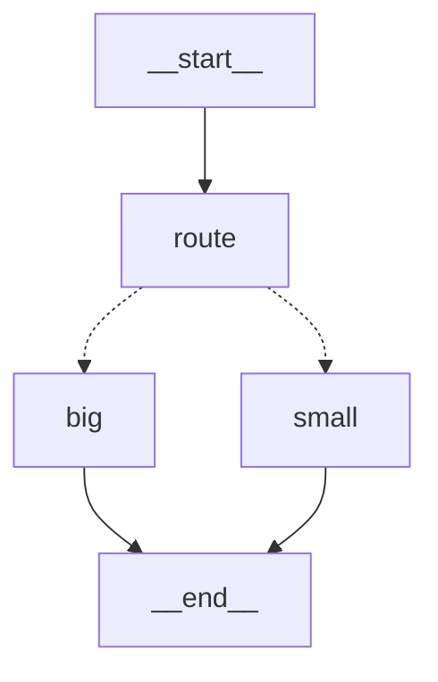
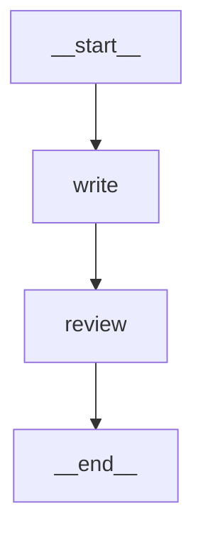
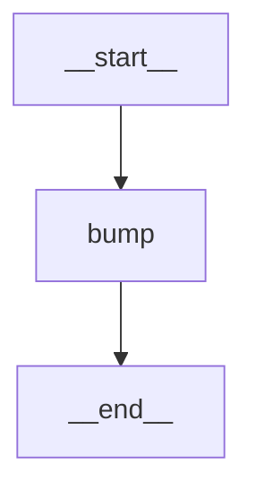
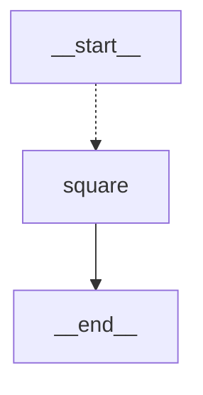

# `langgraph` Reference

**Pinned version: `langgraph==1.2.11`** (released 2026-08-11; it pulls in `langgraph-checkpoint`
4.2.0, `langgraph-prebuilt` 1.1.0 and `langgraph-sdk` 0.4.4). Everything below was derived by
inspecting this exact installed package, and every example was executed against it on Python 3.13.
Each heading links to <a href="https://reference.langchain.com/python/langgraph" target="_blank" rel="noopener">reference.langchain.com</a>,
which is unversioned and always serves the latest 1.x. Links open in a new tab.

Part of a three-file set — see the [README](README.md) for how `langchain-core`,
`langgraph` and `langchain` fit together.

## What `langgraph` is

- **It is a runtime that executes a graph of Python functions over a shared, typed state.** You
  declare the state as a `TypedDict`, register functions as nodes, and wire them with edges; the
  runtime decides execution order, runs independent nodes in parallel, merges each node's returned
  dict into the state (through a *reducer* per key, or by overwriting), and can save the state after
  every step so a run can pause, resume, or be replayed.
- **"Low level" means the level at which agent architecture is expressed** — where you decide the
  loop, the branches and the pause points — not "hard mode".
- **It is model-agnostic.** The runtime does not care what a node does. Every example below is a
  plain Python function that imports nothing but `langgraph` and stdlib `typing`.
- **In LangChain 1.x, `langchain` depends on `langgraph` — not the other way around.**
  `langchain.agents.create_agent` returns a `CompiledStateGraph`, so `invoke`, `stream`,
  checkpointing and `interrupt` on an agent behave exactly as documented below.

### Layer order

```
langchain  ──depends on──▶  langgraph  ──depends on──▶  langchain-core
```

Nothing below depends on anything above it. Verified against the installed packages:

- **`langchain_core` does not import `langgraph`.** After importing every module of
  `langchain-core` 1.6.2, `'langgraph' in sys.modules` is `False`.
- **`langgraph` does not import `langchain`.** `langchain` is absent from its `Requires-Dist`, and
  importing `langgraph.graph`, `langgraph.types`, `langgraph.checkpoint.memory` and
  `langgraph.prebuilt` leaves `'langchain' in sys.modules` `False`. Two optional code paths try it
  lazily inside `try:/except ImportError:` (`init_chat_model` for `"provider:model"` strings in the
  deprecated `create_react_agent`, and `init_embeddings` in the store) and fail soft without it.
- **`langgraph` does depend on `langchain-core`** (`<2,>=1.4.7`) — that is how a node can return
  message objects the rest of the ecosystem understands, and how `MessagesState` converts dicts into
  `HumanMessage`/`AIMessage`.

Every example in this file was executed in a venv where **`langchain` is installed but never
imported** (checked via `sys.modules`).

> **Old tutorials warning:** `langgraph.prebuilt.create_react_agent` still imports, but calling it
> emits `LangGraphDeprecatedSinceV10`: *"create_react_agent has been moved to `langchain.agents`.
> Please update your import to `from langchain.agents import create_agent`. Deprecated in LangGraph
> V1.0 to be removed in V2.0."* The other prebuilt pieces (`ToolNode`, `tools_condition`,
> `InjectedState`, `ToolRuntime`) remain, and `create_agent` uses them internally.

## Index

| Name | What it defines / does | Most-used methods & fields |
| --- | --- | --- |
| [`StateGraph`](#stategraph) | Builder: takes the state `TypedDict`; `add_node` registers a function, `add_edge`/`add_conditional_edges` wire them, `compile()` returns the runnable graph | `add_node`, `add_edge`, `add_conditional_edges`, `compile` |
| [`START` and `END`](#start-and-end) | The strings `"__start__"` and `"__end__"`; an edge from `START` names the entry node, an edge to `END` ends the run | used as edge endpoints |
| [`CompiledStateGraph`](#compiledstategraph) | The runnable `compile()` returns: `invoke`/`stream` execute it, `get_state`/`update_state` read and edit a thread's checkpoint, `get_graph` draws it | `invoke`, `stream`, `get_state`, `update_state`, `get_graph` |
| [`MessagesState`](#messagesstate) | `TypedDict` with one key, `messages: Annotated[list[AnyMessage], add_messages]` — a conversation that grows by appending | `messages` |
| [`add_messages`](#add_messages) | Reducer `(old, new) -> merged`: appends new messages, replaces those whose `id` already exists, deletes on `RemoveMessage`, coerces dicts to message objects | called as `add_messages(left, right)` |
| [`Command`](#command) | Node return value carrying `update=` (state changes) and `goto=` (next node) together; `Command(resume=…)` is also how a paused run is resumed | `goto`, `update`, `resume`, `graph` |
| [`interrupt`](#interrupt) | Called inside a node: saves a checkpoint, stops the run, surfaces `value` under `__interrupt__`; on resume the node re-runs and the call returns the resume payload | called as `interrupt(value)` |
| [`InMemorySaver`](#inmemorysaver) | Dict-backed `BaseCheckpointSaver`: `compile(checkpointer=…)` then saves state after every step, keyed by `thread_id`, enabling resume, `interrupt`, history and time travel | `get_tuple`, `put`, `list`, `delete_thread` |
| [`Send`](#send) | `Send(node, arg)` returned from a conditional edge schedules one run of `node` with `arg` as its input; a list of them fans out in parallel | `node`, `arg` |

---

### <a href="https://reference.langchain.com/python/langgraph/graph/state/StateGraph" target="_blank" rel="noopener"><code>StateGraph</code></a>

The builder. `StateGraph(State)` takes the state schema — a `TypedDict` whose keys are the state
and whose `Annotated[..., reducer]` metadata says how a key is merged (no reducer = overwrite).
Optional `input_schema=`/`output_schema=` narrow what callers pass in and get back, and
`context_schema=` types the read-only `runtime.context` nodes can receive. Then:

- `add_node(name, fn)` registers a function `fn(state) -> dict` (or `-> Command`). The function
  receives the whole state and returns only the keys it changes. Options: `retry_policy`,
  `cache_policy`, `defer=True` (run after all other branches finish), `destinations` (declares
  where a `Command`-returning node may `goto`, for drawing).
- `add_edge(a, b)` always runs `b` after `a`. `add_edge([a, b], c)` waits for both.
- `add_conditional_edges(source, router, path_map)` runs `router(state)` after `source`; its
  return value is looked up in `path_map` (a dict) or used as a node name directly (a list).
- `add_sequence([f, g, h])` adds nodes and the edges between them in one call.
- `compile(checkpointer=, store=, interrupt_before=, interrupt_after=, name=, cache=)` validates
  the graph (every node reachable, every edge target exists) and returns a `CompiledStateGraph`.

```python
from typing import TypedDict

from langgraph.graph import END, START, StateGraph


class State(TypedDict):
    n: int
    label: str


def double(state: State) -> dict:
    return {"n": state["n"] * 2}


def classify(state: State) -> str:
    return "even" if state["n"] % 2 == 0 else "odd"


def mark_even(state: State) -> dict:
    return {"label": "even"}


def mark_odd(state: State) -> dict:
    return {"label": "odd"}


builder = StateGraph(State)
builder.add_node("double", double)
builder.add_node("mark_even", mark_even)
builder.add_node("mark_odd", mark_odd)
builder.add_edge(START, "double")
builder.add_conditional_edges("double", classify, {"even": "mark_even", "odd": "mark_odd"})
builder.add_edge("mark_even", END)
builder.add_edge("mark_odd", END)

graph = builder.compile()
print(graph.invoke({"n": 5, "label": ""}))   # {'n': 10, 'label': 'even'}
print(graph.get_graph().draw_mermaid(with_styles=False))
```

Diagram — generated by the code above:



[↩ back to index](#index)

---

### <a href="https://reference.langchain.com/python/langgraph/constants/START" target="_blank" rel="noopener"><code>START</code></a> and <a href="https://reference.langchain.com/python/langgraph/constants/END" target="_blank" rel="noopener"><code>END</code></a>

Two virtual nodes that mark where execution enters and leaves the graph. They are not classes —
they are the strings `'__start__'` and `'__end__'`, which is exactly why they can be passed anywhere
a node name is expected. `add_edge(START, "x")` makes `x` the entry point (the older
`set_entry_point("x")` does the same); an edge or `Command(goto=END)` into `END` finishes the run.
A graph may have several edges into `END`, and a node with no outgoing edge at all is a build
error.

```python
from langgraph.graph import END, START

print(repr(START), repr(END))   # '__start__' '__end__'
print(isinstance(START, str))   # True
```

[↩ back to index](#index)

---

### <a href="https://reference.langchain.com/python/langgraph/graph/state/CompiledStateGraph" target="_blank" rel="noopener"><code>CompiledStateGraph</code></a>

What `.compile()` hands back, and the only thing you actually run. It is a `Runnable`, so
`invoke`, `batch`, `stream` and their async twins work as on any other. On top of that it adds:

- **Streaming modes.** `stream(input, stream_mode=…)`: `"updates"` (default) yields
  `{node_name: returned_dict}` as each node finishes; `"values"` yields the full state after each
  step; `"messages"` yields model tokens as they arrive; `"custom"` yields what nodes write via
  `get_stream_writer()`; `"debug"` yields everything.
- **The state API**, all taking `config={"configurable": {"thread_id": …}}` and requiring a
  checkpointer: `get_state(config)` returns a `StateSnapshot` (`.values`, `.next` — the nodes about
  to run — `.tasks`, `.config`); `get_state_history(config)` iterates snapshots newest-first;
  `update_state(config, values, as_node=…)` writes a new checkpoint as if a node had returned
  `values`.
- **Introspection.** `get_graph()` returns a drawable graph object (`draw_mermaid()`,
  `draw_mermaid_png()`, `draw_ascii()`); `get_subgraphs()` lists nested compiled graphs.

```python
from typing import TypedDict

from langgraph.graph import END, START, StateGraph


class State(TypedDict):
    n: int


def double(state: State) -> dict:
    return {"n": state["n"] * 2}


def bump(state: State) -> dict:
    return {"n": state["n"] + 1}


builder = StateGraph(State)
builder.add_node("double", double)
builder.add_node("bump", bump)
builder.add_edge(START, "double")
builder.add_edge("double", "bump")
builder.add_edge("bump", END)
graph = builder.compile()

print(type(graph).__name__)           # CompiledStateGraph
print(graph.invoke({"n": 3}))         # {'n': 7}
for chunk in graph.stream({"n": 3}):                        # default stream_mode="updates"
    print(chunk)                      # {'double': {'n': 6}} then {'bump': {'n': 7}}
for snapshot in graph.stream({"n": 3}, stream_mode="values"):
    print(snapshot)                   # {'n': 3} then {'n': 6} then {'n': 7}
print(graph.get_graph().draw_mermaid(with_styles=False))
```

Diagram — generated by the code above:



[↩ back to index](#index)

---

### <a href="https://reference.langchain.com/python/langgraph/graph/message/MessagesState" target="_blank" rel="noopener"><code>MessagesState</code></a>

A ready-made state schema for the common case of "the state is a conversation". It is a `TypedDict`
with a single key, `messages: Annotated[list[AnyMessage], add_messages]`, so nodes return the new
messages only and the runtime appends them. Because the reducer is [`add_messages`](#add_messages),
message-like dicts (`{"role": "user", "content": ...}`) are converted to `HumanMessage`/`AIMessage`
objects on the way in — no model or `langchain` import needed. Subclass it to add keys:
`class State(MessagesState): summary: str`. `langchain.agents.AgentState` is such a subclass.

```python
from langgraph.graph import END, MessagesState, START, StateGraph


def greet(state: MessagesState) -> dict:
    return {"messages": [{"role": "assistant", "content": "Hello!"}]}


builder = StateGraph(MessagesState)
builder.add_node("greet", greet)
builder.add_edge(START, "greet")
builder.add_edge("greet", END)
graph = builder.compile()

result = graph.invoke({"messages": [{"role": "user", "content": "Hi"}]})
for m in result["messages"]:
    print(type(m).__name__, "|", m.content)
# HumanMessage | Hi
# AIMessage | Hello!
print(graph.get_graph().draw_mermaid(with_styles=False))
```

Diagram — generated by the code above:



[↩ back to index](#index)

---

### <a href="https://reference.langchain.com/python/langgraph/graph/message/add_messages" target="_blank" rel="noopener"><code>add_messages</code></a>

The reducer behind `MessagesState`. A reducer is a function `(old, new) -> merged` attached to a
state key via `Annotated`; without one, a node's return value overwrites the key. What this one
does with the incoming list, item by item:

- coerces a dict or `(role, text)` tuple into the matching message class, and assigns a random
  `id` to any message that has none;
- **appends** a message whose `id` is new;
- **replaces in place** a message whose `id` already exists in the old list — that is how history
  is edited rather than duplicated;
- **deletes** the message named by a `RemoveMessage(id=…)`, and clears the whole list on
  `RemoveMessage(id=REMOVE_ALL_MESSAGES)`.

```python
from langchain_core.messages import RemoveMessage
from langgraph.graph import add_messages
from langgraph.graph.message import REMOVE_ALL_MESSAGES

history = add_messages(
    [{"role": "user", "content": "Hi", "id": "1"}],
    [{"role": "assistant", "content": "Hello!", "id": "2"}],
)
print([(type(m).__name__, m.content) for m in history])
# [('HumanMessage', 'Hi'), ('AIMessage', 'Hello!')]

edited = add_messages(history, [{"role": "user", "content": "Hey", "id": "1"}])
print([(type(m).__name__, m.content) for m in edited])
# [('HumanMessage', 'Hey'), ('AIMessage', 'Hello!')]

shorter = add_messages(edited, [RemoveMessage(id="2")])
print([m.content for m in shorter])                                  # ['Hey']

print(add_messages(edited, [RemoveMessage(id=REMOVE_ALL_MESSAGES)]))  # []
```

[↩ back to index](#index)

---

### <a href="https://reference.langchain.com/python/langgraph/types/Command" target="_blank" rel="noopener"><code>Command</code></a>

A dataclass a node can return instead of a plain dict. Its fields, all optional:

- `update` — the state changes (same shape as a returned dict).
- `goto` — the next node name, a list of names (run in parallel), a `Send`, or `END`. This
  replaces a separate routing function when the node already knows where to go.
- `graph` — `Command.PARENT` makes `goto` target a node of the *parent* graph when the node lives
  inside a subgraph.
- `resume` — used from *outside*, as the input to `invoke`, to continue a run paused by
  [`interrupt`](#interrupt); its value is what the `interrupt()` call returns.

Annotating the return type as `Command[Literal["big", "small"]]` (or passing `destinations=` to
`add_node`) is what lets `get_graph()` draw the possible jumps — without it the diagram shows no
edges out of the node, though execution is unaffected.

```python
from typing import Literal, TypedDict

from langgraph.graph import END, START, StateGraph
from langgraph.types import Command


class State(TypedDict):
    n: int
    path: str


def route(state: State) -> Command[Literal["big", "small"]]:
    if state["n"] > 10:
        return Command(goto="big", update={"path": "big"})
    return Command(goto="small", update={"path": "small"})


def big(state: State) -> dict:
    return {"n": state["n"] + 100}


def small(state: State) -> dict:
    return {"n": state["n"] + 1}


builder = StateGraph(State)
builder.add_node("route", route)
builder.add_node("big", big)
builder.add_node("small", small)
builder.add_edge(START, "route")
builder.add_edge("big", END)
builder.add_edge("small", END)
graph = builder.compile()

print(graph.invoke({"n": 42, "path": ""}))   # {'n': 142, 'path': 'big'}
print(graph.get_graph().draw_mermaid(with_styles=False))
```

Diagram — generated by the code above:



[↩ back to index](#index)

---

### <a href="https://reference.langchain.com/python/langgraph/types/interrupt" target="_blank" rel="noopener"><code>interrupt</code></a>

A function called *inside* a node: `interrupt(value)`. What happens, in order:

1. The runtime writes a checkpoint (so a `checkpointer` is required — without one it raises) and
   stops the run. `invoke` returns the state so far plus an `__interrupt__` key holding a list of
   `Interrupt` objects, each with `.value` (what you passed) and `.id`.
2. The caller does whatever the pause is for — shows the value to a person, waits a week.
3. The caller invokes the *same thread* with `Command(resume=payload)`. The interrupted node runs
   again **from its first line**; this time `interrupt()` does not pause but returns `payload`, and
   the node continues to its return.

The re-run in step 3 is the detail that bites: code before the `interrupt()` call executes twice,
so keep side effects after it or make them idempotent. The example counts the node's runs to show
this.

```python
from typing import TypedDict

from langgraph.checkpoint.memory import InMemorySaver
from langgraph.graph import END, START, StateGraph
from langgraph.types import Command, interrupt

runs = {"review": 0}


class State(TypedDict):
    draft: str
    approved: str


def write(state: State) -> dict:
    return {"draft": "ship it"}


def review(state: State) -> dict:
    runs["review"] += 1                                     # executes on both passes
    decision = interrupt({"question": "Approve this draft?", "draft": state["draft"]})
    return {"approved": decision}


builder = StateGraph(State)
builder.add_node("write", write)
builder.add_node("review", review)
builder.add_edge(START, "write")
builder.add_edge("write", "review")
builder.add_edge("review", END)
graph = builder.compile(checkpointer=InMemorySaver())

config = {"configurable": {"thread_id": "1"}}
paused = graph.invoke({"draft": "", "approved": ""}, config)
print(paused["__interrupt__"][0].value)
# {'question': 'Approve this draft?', 'draft': 'ship it'}
print(graph.get_state(config).next)                        # ('review',)  <- where it will resume

resumed = graph.invoke(Command(resume="yes"), config)
print(resumed)                                             # {'draft': 'ship it', 'approved': 'yes'}
print("review ran", runs["review"], "times")               # review ran 2 times
print(graph.get_graph().draw_mermaid(with_styles=False))
```

Diagram — generated by the code above:



[↩ back to index](#index)

---

### <a href="https://reference.langchain.com/python/langgraph.checkpoint/memory/InMemorySaver" target="_blank" rel="noopener"><code>InMemorySaver</code></a>

A checkpointer: pass one to `compile(checkpointer=…)` and the graph writes a snapshot of the state
after every step, filed under the `thread_id` in `config["configurable"]`. That single change is
what turns a one-shot graph into a resumable, inspectable conversation:

- **Continuation.** Invoking the same `thread_id` again starts from the saved state and merges
  the new input into it through the reducers, so a `MessagesState` graph remembers earlier turns
  (a key without a reducer, like `count` below, is simply overwritten by the new input).
- **Pausing.** [`interrupt`](#interrupt) and `interrupt_before`/`interrupt_after` need somewhere
  to park the run.
- **History and time travel.** `get_state_history(config)` returns every checkpoint; invoking with
  one of those checkpoints' `config` replays from that point.

It implements
<a href="https://reference.langchain.com/python/langgraph.checkpoint/base/BaseCheckpointSaver" target="_blank" rel="noopener"><code>BaseCheckpointSaver</code></a>,
the interface every backend satisfies: `put` (store a checkpoint), `put_writes` (store a node's
pending writes), `get_tuple` (load the latest, or a specific one), `list` (iterate a thread's
checkpoints), `delete_thread`, and async twins. `InMemorySaver` keeps all of it in a dict, so it is
for development and tests; `langgraph-checkpoint-sqlite` and `langgraph-checkpoint-postgres` are
the production swaps and change nothing else in your code.

```python
from typing import TypedDict

from langgraph.checkpoint.base import BaseCheckpointSaver
from langgraph.checkpoint.memory import InMemorySaver
from langgraph.graph import END, START, StateGraph


class State(TypedDict):
    count: int


def bump(state: State) -> dict:
    return {"count": state["count"] + 1}


builder = StateGraph(State)
builder.add_node("bump", bump)
builder.add_edge(START, "bump")
builder.add_edge("bump", END)

checkpointer = InMemorySaver()
print(isinstance(checkpointer, BaseCheckpointSaver))   # True
graph = builder.compile(checkpointer=checkpointer)

config = {"configurable": {"thread_id": "session-1"}}
print(graph.invoke({"count": 0}, config))     # {'count': 1}
print(graph.get_state(config).values)         # {'count': 1}
print(graph.get_state(config).next)           # () — the run finished

for snap in graph.get_state_history(config):   # newest first: 3 checkpoints for one run
    print(snap.metadata["step"], snap.values, snap.next)
# 1 {'count': 1} ()            <- after bump
# 0 {'count': 0} ('bump',)     <- input written, bump about to run
# -1 {} ('__start__',)         <- the empty thread

print(graph.invoke({"count": 10}, config))    # {'count': 11}  <- same thread, run again
print(len(list(checkpointer.list(config))))   # 6 — the saver holds both runs
graph.update_state(config, {"count": 100}, as_node="bump")
print(graph.get_state(config).values)         # {'count': 100} <- written as if bump returned it
print(graph.get_graph().draw_mermaid(with_styles=False))
```

Diagram — generated by the code above:



[↩ back to index](#index)

---

### <a href="https://reference.langchain.com/python/langgraph/types/Send" target="_blank" rel="noopener"><code>Send</code></a>

`Send(node, arg)` is an instruction to run `node` once with `arg` as its input *instead of* the
shared state. Return a list of them from a conditional-edge router (or as `Command(goto=[...])`)
and the runtime schedules one task per `Send`, all in the same step and in parallel; each task's
returned dict is merged back into the shared state through the key's reducer. That is the map half
of map-reduce, and the way to branch N ways when N is only known at runtime. The receiving node's
parameter is whatever you passed as `arg`, so type it accordingly, not as the graph's `State`.

```python
from typing import Annotated, TypedDict

from langgraph.graph import END, START, StateGraph
from langgraph.types import Send


class State(TypedDict):
    items: list
    results: Annotated[list, lambda a, b: a + b]


def fan_out(state: State):
    return [Send("square", {"value": i}) for i in state["items"]]


def square(state: dict) -> dict:           # receives {"value": i}, not the State
    return {"results": [state["value"] ** 2]}


builder = StateGraph(State)
builder.add_node("square", square)
builder.add_conditional_edges(START, fan_out, ["square"])
builder.add_edge("square", END)
graph = builder.compile()

print(graph.invoke({"items": [1, 2, 3], "results": []}))
# {'items': [1, 2, 3], 'results': [1, 4, 9]}
print(graph.get_graph().draw_mermaid(with_styles=False))
```

Diagram — generated by the code above:



[↩ back to index](#index)
